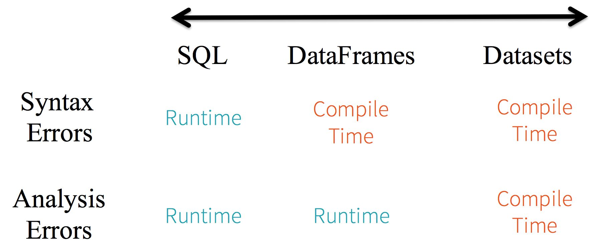

RDD、DataFrame、Dataset的区别及互相转换
------
* [Contents](#Contents)
	* [RDD和DataFrame区别](#RDD和DataFrame区别)
	* [Dataset](#Dataset)
	* [Dataset和DataFrame区别](#Dataset和DataFrame区别)
	* [RDD和DataFrame转换](#RDD和DataFrame转换)
	* [RDD和Dataset转换](#RDD和Dataset转换)
	* [DataFrame和Dataset转换](#DataFrame和Dataset转换)
## RDD和DataFrame区别
DataFrame其实就是RDD+schema，是以列进行组合的分布式数据集。类似于关系型数据库中的表，
和python/R中的data frame很相似。并且具有select、filtering、aggregation、plotting的抽象。
在spark<1.3版本时，对应就是SchemaRDD。


上图直观地体现了DataFrame和RDD的区别。左侧的RDD[Person]虽然以Person为类型参数，
但Spark框架本身不了解Person类的内部结构。而右侧的DataFrame却提供了详细的结构信息，
使得Spark SQL可以清楚地知道该数据集中包含哪些列，每列的名称和类型各是什么。
DataFrame多了数据的结构信息，即schema。RDD是分布式的Java对象的集合。
DataFrame是分布式的Row对象的集合。DataFrame除了提供了比RDD更丰富的算子以外，
更重要的特点是提升执行效率、减少数据读取以及执行计划的优化，比如filter下推、裁剪等。

**DataFrame优点**
1. 提升执行效率

    RDD API是函数式的，强调不变性，在大部分场景下倾向于创建新对象而不是修改老对象。
    这一特点虽然带来了干净整洁的API，却也使得Spark应用程序在运行期倾向于创建大量临时对象，
    对GC造成压力。在现有RDD API的基础之上，我们固然可以利用mapPartitions方法来重载RDD
    单个分片内的数据创建方式，用复用可变对象的方式来减小对象分配和GC的开销，但这牺牲了代码的可读性，
    而且要求开发者对Spark运行时机制有一定的了解，门槛较高。另一方面，Spark SQL在框架内部已经在
    各种可能的情况下尽量重用对象，这样做虽然在内部会打破了不变性，但在将数据返回给用户时，
    还会重新转为不可变数据。利用 DataFrame API进行开发，可以免费地享受到这些优化效果。
2. 减少数据读取
    
    对于一些“智能”数据格 式，Spark SQL还可以根据数据文件中附带的统计信息来进行剪枝。简单来说，在这类数据格式中，
    数据是分段保存的，每段数据都带有最大值、最小值、null值数量等 一些基本的统计信息。当统计信息表名某一数据段肯定
    不包括符合查询条件的目标数据时，该数据段就可以直接跳过（例如某整数列a某段的最大值为100，而查询条件要求a > 200）。
    此外，Spark SQL也可以充分利用RCFile、ORC、Parquet等列式存储格式的优势，仅扫描查询真正涉及的列，忽略其余列的数据。
3.  执行优化
    
    Spark sql会做执行计划的优化，比如filter下推、裁剪等
    
    
## Dataset
Dataset是分布式数据集合。是Spark1.6中添加的新接口，它提供了RDD的优点（强类型、使用强大lambda函数的能力）以及Spark SQL优化执行引擎的优势。
数据集可以从JVM对象构建，然后使用功能转换（map, flatMap, filter, 等）进行操作。数据集API可用于Scala和Java但是Python不支持Dataset API。

**Dataset API的优势**

1. 静态类型和运行时类型安全

   考虑静态类型和运行时类型安全，SQL有很少的限制而Dataset限制很多。例如，Spark SQL查询语句，
   你直到运行时才能发现语法错误(syntax error)，代价较大。然后DataFrame和Dataset在编译时就可捕捉到错误，节约开发时间和成本。
   Dataset API都是lambda函数和JVM typed object，任何typed-parameters不匹配即会在编译阶段报错。因此使用Dataset节约开发时间。
   
   
2. High-level抽象以及结构化和半结构化数据集的自定义视图

   JSON是一个半结构化数据格式，用Scala为JSON数据定义一个case class:MyJsonClass，
   就可以产生一个Dataset[MyJsonClass],可以方便使用Dataset API。
   
   这里Spark会做三件事：
   - 读取JSON文件，推断出其schema，创建一个DataFrame；
   - 把数据集转换DataFrame -> Dataset[Row]，泛型Row object，因为这时还不知道其确切类型；
   - 进行类型转换：Dataset[Row] -> Dataset[MyJsonClass]，MyJsonClass类的Scala JVM object。
3. 简单易用的API

   虽然结构化数据会给Spark程序操作数据集带来挺多限制，但它却引进了丰富的语义和易用的特定领域语言。
   大部分计算可以被Dataset的high-level API所支持。例如，操作agg，select，avg，map，filter或者groupBy。
4. 性能和优化
   
   Dataset API是建立在Spark SQL引擎之上，它会使用Catalyst优化器来生成优化过的逻辑计划和物理查询计划。
   其次，Spark作为编译器可以理解Dataset类型的JVM object，它能映射特定类型的JVM object到Tungsten内存管理，使用Encoder。
   Tungsten的Encoder可以有效的序列化/反序列化JVM object，生成字节码来提高执行速度。
## Dataset和DataFrame区别
DataFrame可以认为是Dataset的一个特例，在Scala中DataFrame=Dataset[Row]。
主要区别是Dataset每一个record存储的是一个强类型值而不是一个Row。
## RDD和DataFrame转换
1. 基于反射方式(RDD->DataFrame)

    该方式需要定义case class，相当于表结构，然后将数据读入形成RDD，并将RDD与case class关联。
    在scala中使用反射方式，会进行rdd到dataframe的转换。这里需要手动导入一个隐式转换：import spark.implicits._
    
    ```scala
    // For implicit conversions from RDDs to DataFrames
    import spark.implicits._
    
    // Create an RDD of Person objects from a text file, convert it to a Dataframe
    val peopleDF = spark.sparkContext
      .textFile("examples/src/main/resources/people.txt")
      .map(_.split(","))
      .map(attributes => Person(attributes(0), attributes(1).trim.toInt))
      .toDF()
    // Register the DataFrame as a temporary view
    peopleDF.createOrReplaceTempView("people")
    
    // SQL statements can be run by using the sql methods provided by Spark
    val teenagersDF = spark.sql("SELECT name, age FROM people WHERE age BETWEEN 13 AND 19")
    ```
    [示例代码: RDD2DataFrame1.scala](../src/main/scala/org/spark/notes/RDD2DataFrame1.scala)
2.  编程接口方式(RDD->DataFrame)
    
    该方式需要先将RDD数据映射成Row（RDD[T]->RDD[Row]），然后编程方式动态创建StructType来定义结构
    包括字段名，字段类型，是否可以为空，最后将schema信息映射到rowRDD创建DataFrame。
    
    ```scala
    import org.apache.spark.sql.types._
    
    // Create an RDD
    val peopleRDD = spark.sparkContext.textFile("examples/src/main/resources/people.txt")
    // The schema is encoded in a string
    val schemaString = "name age"
    
    // Generate the schema based on the string of schema
    val fields = schemaString.split(" ")
      .map(fieldName => StructField(fieldName, StringType, nullable = true))
    val schema = StructType(fields)
    
    // Convert records of the RDD (people) to Rows
    val rowRDD = peopleRDD
      .map(_.split(","))
      .map(attributes => Row(attributes(0), attributes(1).trim))
    
    // Apply the schema to the RDD
    val peopleDF = spark.createDataFrame(rowRDD, schema)
    ```
    [示例代码: RDD2DataFrame2.scala](../src/main/scala/org/spark/notes/RDD2DataFrame2.scala)
    
3. DataFrame转RDD
   
   这很简单直接df.rdd（DataFrame->RDD[Row]）
## RDD和Dataset转换
1. RDD转Dataset
   
   定义一个case class，将rdd的每行数据转成对于的class对象，然后直接调用toDS方法。
   这里需要手动导入一个隐式转换：import spark.implicits._
   
   ```scala
   case class Person(name: String, age: Long)
   
   // 序列的对象集合也可以直接toDs
   // Encoders are created for case classes
   val caseClassDS = Seq(Person("Andy", 32)).toDS()
  
   // Encoders for most common types are automatically provided by importing spark.implicits._
   val primitiveDS = Seq(1, 2, 3).toDS()
   primitiveDS.map(_ + 1).collect() // Returns: Array(2, 3, 4)
   ```
   [示例代码: RDD2Dataset.scala](../src/main/scala/org/spark/notes/RDD2Dataset.scala)
2. Dataset转RDD
   
   这很简单直接ds.rdd（Dataset[T]->RDD[T]）
## DataFrame和Dataset转换
1. DataFrame转Dataset

   定义一个cass class，直接将DF.as[T]转成Dataset
   ```scala
   import spark.implicits._
   case class Coltest(col1:String, col2:Int) extends Serializable //定义字段名和类型
   val testDS = testDF.as[Coltest]
   ```
2. Dataset转DataFrame

   这很简单直接ds.toDF（Dataset[T]->DataFrame）
   这里需要手动导入一个隐式转换：import spark.implicits._
   ```scala
   import spark.implicits._
   val testDF = testDS.toDF
   ```
   

    
    