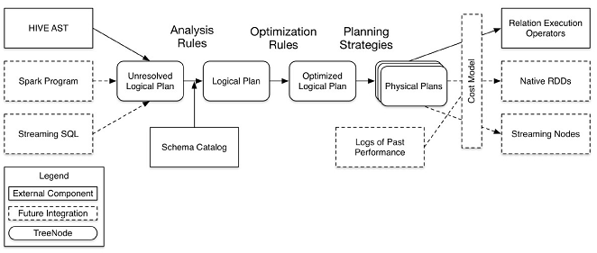

Spark SQL介绍
------
* [Contents](#Contents)
	* [发展历程](#发展历程)
	* [优点特征](#优点特征)
	* [运行架构](#运行架构)
	
spark SQL是spark的一个模块，主要用于进行结构化数据的处理。它提供的最核心的编程抽象就是DataFrame。
和基本的Spark RDD API不同的是Spark SQL提供了更多关于数据结构和正在执行的计算的信息。
在内部，Spark SQL使用这些额外的信息来执行额外的优化。可以使用SQL或者Dataset API与Spark SQL进行交互。

## 发展历程
1. 1.0以前：

    Shark，SparkSQL的前身是Shark。但是，随着Spark的发展，Shark对于Hive的太多依赖
（如采用Hive的语法解析器、查询优化器等等），制约了Spark的One Stack Rule Them All的既定方针，
制约了Spark各个组件的相互集成，所以提出了SparkSQL项目。
2. 1.1.x开始：

    SparkSQL(只是测试性的) SQL
3. 1.3.x:

    SparkSQL(正式版本)引入Dataframe，在spark<1.3版本时，对应就是SchemaRDD
4. 1.5.x:

    SparkSQL 钨丝计划
5. 1.6.x：

    SparkSQL+DataFrame+DataSet，引入DataSet
6. 2.0.0之后：

    SparkSession，引入了Strcutured Streaming
    
## 优点特征
1. 集成化

    将SQL查询与Spark程序无缝对接，使用SQL或熟悉的DataFrame API查询Spark程序内的结构化数据。
可用于Java，Scala，Python和R。
2. 统一的数据访问

    以read、write同样的方式连接到任何数据源。提供了访问各种数据源的常用方式，
包括Hive，Avro，Parquet，ORC，JSON和JDBC甚至可以通过这些来源加入数据。
3. 集成hive

    Spark SQL支持HiveQL语法以及Hive SerDes和UDF等，允许访问现有的Hive仓库。
4. 标准的数据连接

    可以通过JDBC或ODBC连接Spark SQL
## 运行架构
SparkSQL架构分成三个部分，第一部分是前端的，第二部分是后端的，对三个部分是中间的Catalyst，Catalyst是整个架构的核心
负责处理查询语句的整个过程，包括解析、绑定、优化、物理计划等。

1. 前端提供不同的访问形式
- 典型的我们可以使用hive，hive过来就是一个SQL语句，SQL语句其实就是一个字符串。
- 第二种访问方式，我们可以通过spark的应用程序，编程的方式来操作，编程的时候我们可以使用SQL，
  也可以使用dataframe或者是dataset api。
- 第三种是Streaming SQL，也就是说流和SQL综合起来使用。
2. Catalyst
- 当前端过来以后他首先会生成一个Unresolved Logical Plan，也就是一个没有彻底解析完的一个执行计划，
  这个执行计划会和我们的元数据metastore里面的schema一个表信息进行整合然后生成一个Logical Plan（逻辑执行计划）。
- 逻辑执行计划是最原始的，中间还会做各种优化也很多规则作用上去，也就是图中的Optimization Rules，
  然后进行优化以后生成优化过后的逻辑执行计划，就是图中的Optimized Logical Plan。
- 逻辑执行计划生成完了以后，才会生成物理执行计划，也就是我们spark的一个作业。
3. 后端
- 本质转化为RDD，然后提交到集群执行

