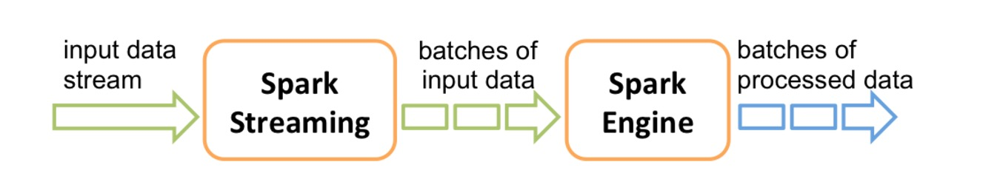
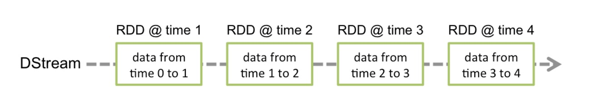
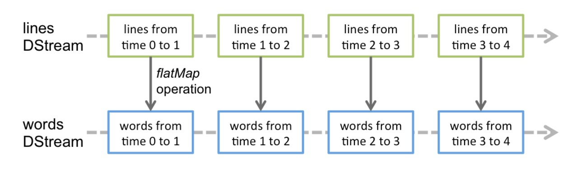
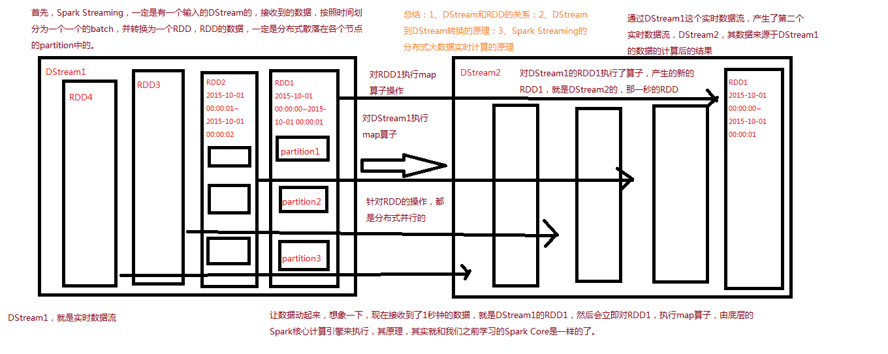
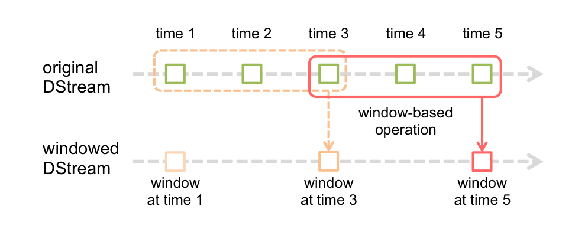

Spark Streaming 基本工作原理
------
* [Contents](#Contents)
    * [DStream](#DStream)
    * [transformation](#transformation)
        * [updateStateByKey](#updatestatebykey)
        * [transform](#transform)
        * [window](#window)
    * [output和foreachRDD](#output和foreachRDD)
    * [与Spark SQL结合](#与Spark-SQL结合)
    * [缓存与持久化](#缓存与持久化)
    * [Checkpoint](#Checkpoint)
        * [何时开启Checkpoint机制](#何时开启Checkpoint机制)
        * [如何配置Checkpoint](#如何配置Checkpoint)
   
Spark Streaming 内部的基本工作原理如下：接收实时输入数据流，然后将数据拆分成多个 batch，
比如每收集1秒的数据封装为一个batch，然后将每个batch交给Spark的计算引擎进行处理，
最后会生产出一个结果数据流，其中的数据，也是由一个一个的batch所组成的。



## DStream
Spark Streaming 提供了一种高级的抽象，叫做 DStream，英文全称为 Discretized Stream，
中文翻译为“离散流”，它代表了一个持续不断的数据流。DStream可以通过输入数据源来创建，比如Kafka、Flume和Kinesis、TCP sockets；
也可以通过对其他DStream应用高阶函数来创建，比如map、reduce、join、window。  

DStream的内部，其实一系列持续不断产生的RDD。RDD是Spark Core的核心抽象，即，不可变的，分布式的数据集。
DStream中的每个RDD都包含了一个时间段内的数据。  



对DStream应用的算子，比如map，其实在底层会被翻译为对DStream中每个RDD的操作。比如对一个DStream执行一个map操作，
会产生一个新的DStream。但是，在底层，其实其原理为，对输入DStream中每个时间段的RDD，都应用一遍map操作，
然后生成的新的RDD，即作为新的DStream中的那个时间段的一个RDD。底层的RDD的transformation操作，其实，
还是由Spark Core的计算引擎来实现的。Spark Streaming对Spark Core进行了一层封装，隐藏了细节，
然后对开发人员提供了方便易用的高层次的API。  



Spark Streaming的具体工作原理如下：




## transformation
对于基础的操作就不一一列出来来，参考[官网文档](http://spark.apache.org/docs/latest/streaming-programming-guide.html#transformations-on-dstreams)

#### updateStateByKey
updateStateByKey操作，可以让我们为每个key维护一份state，并持续不断的更新该state。
1. 首先，要定义一个state，可以是任意的数据类型；
2. 其次，要定义state更新函数——指定一个函数如何使用之前的state和新值来更新state。

对于每个batch，Spark都会为每个之前已经存在的key去应用一次state更新函数，
无论这个key在batch中是否有新的数据。如果state更新函数返回none，那么key对应的state就会被删除。

> tip:  
   1、对于每个新出现的key，也会执行state更新函数。  
   2、updateStateByKey操作，要求必须开启Checkpoint机制。

[updateStateByKey操作示例代码: StatefulNetWorkWC.scala](../src/main/scala/org/spark/notes/StatefulNetWorkWC.scala)

#### transform
transform操作，应用在DStream上时，可以用于执行任意的RDD到RDD的转换操作。它可以用于实现，
DStream API中所没有提供的操作。比如说，DStream API中，并没有提供将一个DStream中的每个batch，
与一个特定的RDD进行join的操作。但是我们自己就可以使用transform操作来实现该功能。  
DStream.join()，只能join其他DStream。在DStream每个batch的RDD计算出来之后，会去跟其他DStream的RDD进行join。  

[Transform操作示例代码: BlacklistFilterByTransform.scala](../src/main/scala/org/spark/notes/BlacklistFilterByTransform.scala)

#### window
窗口计算操作算子，可以定时的进行一个时间段内的数据计算处理。



如图所示，每当窗口滑过源DStream时，落在窗口内的源RDD被组合并进行操作以产生窗口DStream的RDD。
在这种具体情况下，操作应用于最近3个时间单位的数据，并以2个时间单位滑动。这表明任何窗口操作都需要指定两个参数：
window length （窗口的长度）：窗口的持续时间 Seconds(30)
sliding interval （窗口的间隔）：执行窗口操作的间隔 Seconds(3)
这两个参数必须是源DStream的批间隔的倍数（即：newStreamingContext(sparkConf,Seconds(3))）
总结每隔sliding interval时间计算前window length 时间内的数据.

一些基础知识参看[官方文档](http://spark.apache.org/docs/latest/streaming-programming-guide.html#window-operations)  

[Window 操作示例代码: NetWorkWCByWindow.scala](../src/main/scala/org/spark/notes/NetWorkWCByWindow.scala)

## output和foreachRDD
DStream中的所有计算，都是由output操作触发的，比如print()。  

此外，即使你使用了foreachRDD output操作，也必须在里面对RDD执行action操作，才能触发对每一个batch的计算逻辑。
否则，光有foreachRDD output操作，在里面没有对RDD执行action操作，也不会触发任何逻辑。

通常在foreachRDD中，都会创建一个Connection，比如JDBC Connection，然后通过Connection将数据写入外部存储。  
``` scala
dstream.foreachRDD { rdd =>
  rdd.foreachPartition { partitionOfRecords =>
    val connection = ConnectionPool.getConnection()
    partitionOfRecords.foreach(record => connection.send(record))
    ConnectionPool.returnConnection(connection)  
  }
}
```
[foreachRDD 示例代码: StatefulNetWorkWC2Mysql.scala](../src/main/scala/org/spark/notes/StatefulNetWorkWC2Mysql.scala)

## 与Spark SQL结合
Spark Streaming最强大的地方在于，可以与Spark Core、Spark SQL整合使用，之前已经通过transform、
foreachRDD等算子看到，如何将DStream中的RDD使用Spark Core执行批处理操作。现在介绍，如何将DStream中的RDD与Spark SQL结合起来使用。  

[Spark Streaming 结合 SQL示例代码: NetWorkWCBySql.scala](../src/main/scala/org/spark/notes/NetWorkWCBySql.scala)
## 缓存与持久化
与RDD类似，Spark Streaming也可以让开发人员手动控制，将数据流中的数据持久化到内存中。
对DStream调用persist()方法，就可以让Spark Streaming自动将该数据流中的所有产生的RDD，
都持久化到内存中。如果要对一个DStream多次执行操作，那么，对DStream持久化是非常有用的。
因为多次操作，可以共享使用内存中的一份缓存数据。

对于基于窗口的操作，比如reduceByWindow、reduceByKeyAndWindow，以及基于状态的操作，
比如updateStateByKey，默认就隐式开启了持久化机制。即Spark Streaming默认就会将上述操作产生的Dstream中的数据，
缓存到内存中，不需要开发人员手动调用persist()方法。

对于通过网络接收数据的输入流，比如socket、Kafka、Flume等，默认的持久化级别，是将数据复制一份，
以便于容错。相当于是MEMORY_ONLY_SER_2。

**与RDD不同的是，默认的持久化级别，统一都是要序列化的。**

## Checkpoint
每一个Spark Streaming应用，正常来说，都是要7 * 24小时运转的，这就是实时计算程序的特点。
因为要持续不断的对数据进行计算。因此，对实时计算应用的要求，应该是必须要能够对与应用程序逻辑无关的失败，进行容错。  

如果要实现这个目标，Spark Streaming程序就必须将足够的信息checkpoint到容错的存储系统上，
从而让它能够从失败中进行恢复。有两种数据需要被进行checkpoint：  
* 元数据checkpoint——将定义了流式计算逻辑的信息，保存到容错的存储系统上，比如HDFS。
当运行Spark Streaming应用程序的Driver进程所在节点失败时，该信息可以用于进行恢复。元数据信息包括了：
    * 配置信息——创建Spark Streaming应用程序的配置信息，比如SparkConf中的信息。
    * DStream的操作信息——定义了Spark Stream应用程序的计算逻辑的DStream操作信息。
    * 未处理的batch信息——那些job正在排队，还没处理的batch信息。
* 数据checkpoint——将实时计算过程中产生的RDD的数据保存到可靠的存储系统中。要避免由于依赖链条越来越长，
导致的一起变得越来越长的失败恢复时间，有状态的transformation操作执行过程中间产生的RDD，
会定期地被checkpoint到可靠的存储系统上，比如HDFS。从而削减RDD的依赖链条，进而缩短失败恢复时，RDD的恢复时间。

元数据checkpoint主要是为了从driver失败中进行恢复；而RDD checkpoint主要是为了，使用到有状态的transformation操作时，
能够在其生产出的数据丢失时，进行快速的失败恢复。

#### 何时开启Checkpoint机制
* 使用了有状态的transformation操作——比如updateStateByKey，或者reduceByKeyAndWindow操作，被使用了，
那么checkpoint目录要求是必须提供的，也就是必须开启checkpoint机制，从而进行周期性的RDD checkpoint。

* 要保证可以从Driver失败中进行恢复——元数据checkpoint需要启用，来进行这种情况的恢复。

#### 如何配置Checkpoint
* 对于有状态的transformation操作，启用checkpoint机制，定期将其生产的RDD数据checkpoint，是比较简单的。

可以通过配置一个容错的、可靠的文件系统（比如HDFS）的目录，来启用checkpoint机制，checkpoint数据就会写入该目录。
使用StreamingContext的checkpoint()方法即可。然后，你就可以放心使用有状态的transformation操作了。

* 如果为了要从Driver失败中进行恢复，那么启用checkpoint机制，是比较复杂的。需要改写Spark Streaming应用程序。

当应用程序第一次启动的时候，需要创建一个新的StreamingContext，并且调用其start()方法，进行启动。当Driver从失败中恢复过来时，
需要从checkpoint目录中记录的元数据中，恢复出来一个StreamingContext。

[StreamingCheckpoint示例代码: StreamingCheckpoint.scala](../src/main/scala/org/spark/notes/StreamingCheckpoint.scala)

重写应用程序只是第一步，要能够自动从Driver失败中恢复过来，运行Spark Streaming应用程序的集群，
就必须监控Driver运行的过程，并且在它失败时将它重启。对于Spark自身的standalone模式，
需要进行一些配置去supervise driver，在它失败时将其重启。  
首先，要在spark-submit中，添加--deploy-mode参数，默认其值为client，即在提交应用的机器上启动Driver；
但是，要能够自动重启Driver，就必须将其值设置为cluster；此外，需要添加--supervise参数。

> tips:  
   将RDD checkpoint到可靠的存储系统上，会耗费很多性能。当RDD被checkpoint时，会导致这些batch的处理时间增加。
   因此，checkpoint的间隔，需要谨慎的设置。对于那些间隔很多的batch，比如1秒，如果还要执行checkpoint操作，
   则会大幅度削减吞吐量。而另外一方面，如果checkpoint操作执行的太不频繁，那就会导致RDD的lineage变长，
   又会有失败恢复时间过长的风险。  
   对于那些要求checkpoint的有状态的transformation操作，默认的checkpoint间隔通常是batch间隔的数倍，至少是10秒。
   使用DStream的checkpoint()方法，可以设置这个DStream的checkpoint的间隔时长。通常来说，将checkpoint间隔设置
   为窗口操作的滑动间隔的5~10倍，是个不错的选择。  
