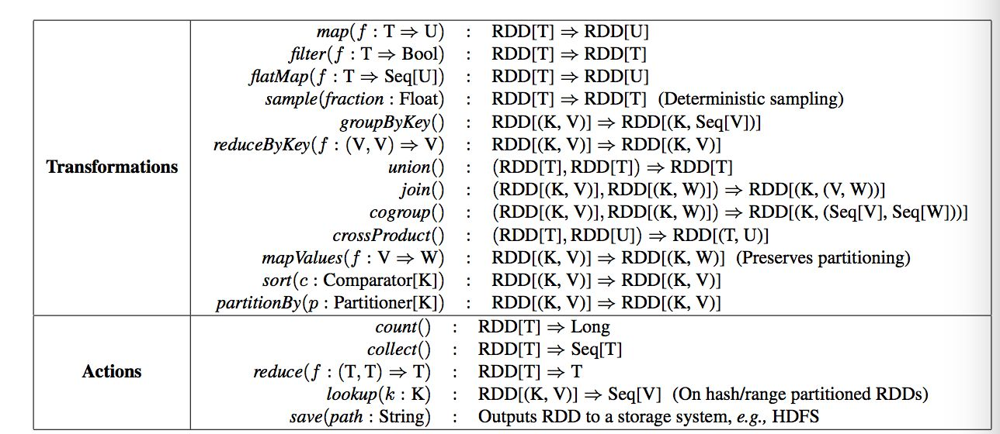
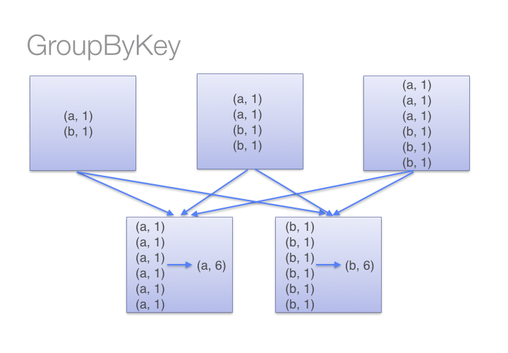
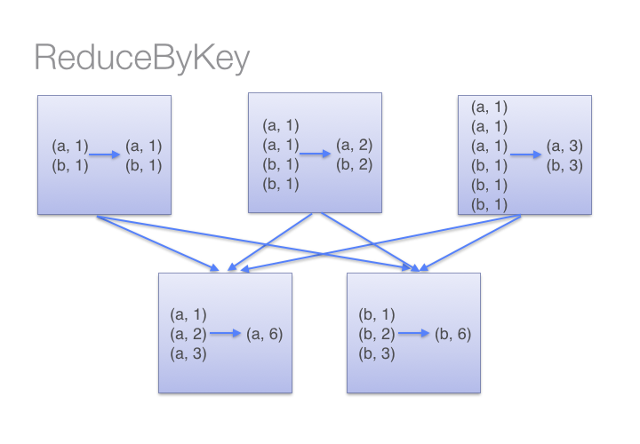
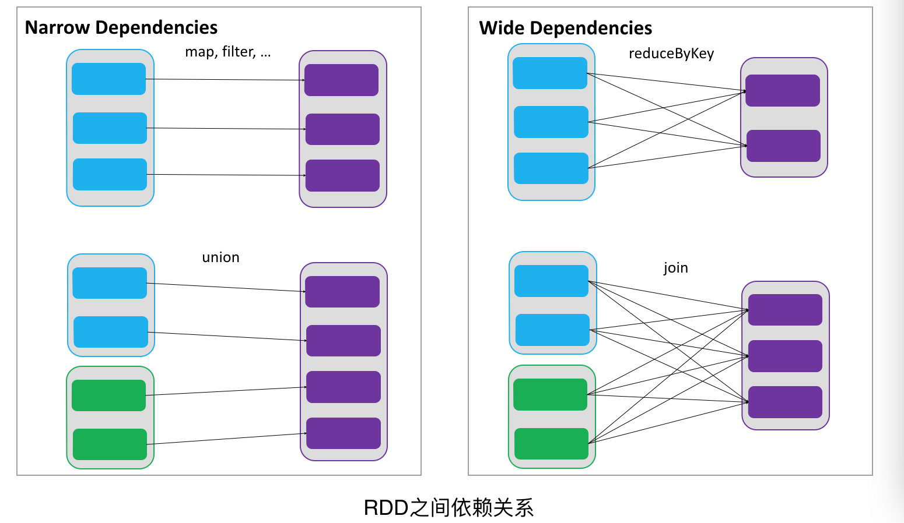
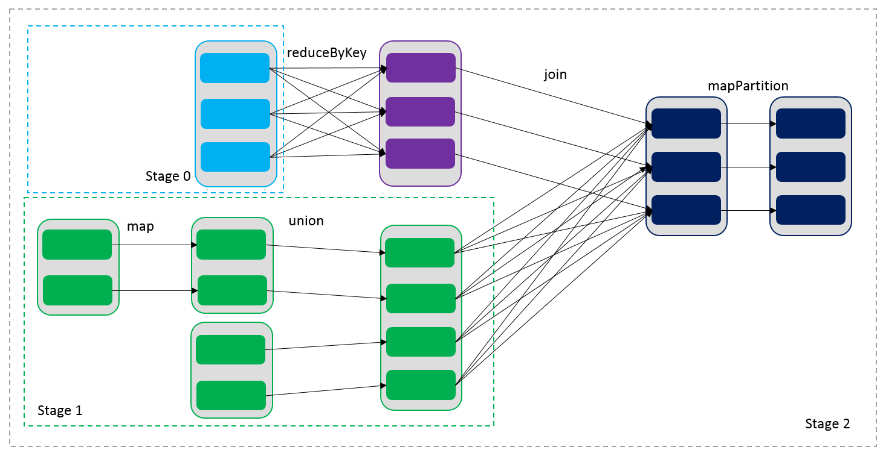
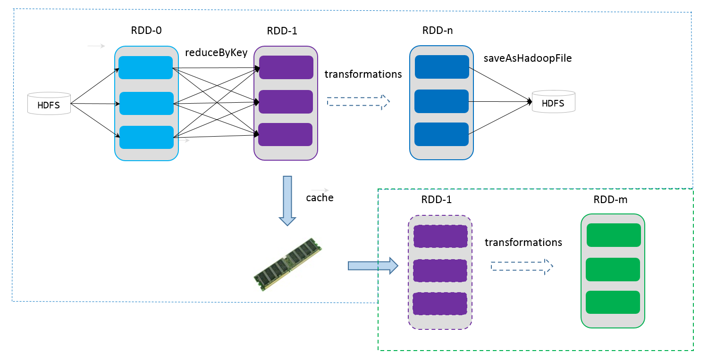

Spark RDD 核心算子介绍 
------
Spark RDD支持两种类型的操作： 
- transformations 转换（从现有数据集创建新的数据集，本质是RDD到RDD）
- actions 操作（在数据集上运行计算后将值返回到驱动程序，本质是RDD到result）

Spark中的所有transformations算子都是惰性的，它们不会立即计算结果。他们只记录应用于数据集上的转换操作
Actions算子则会触发Spark job，将最后结果返回到驱动程序。这种设计使Spark能够更有效地运行。



## [transformations算子](http://spark.apache.org/docs/2.2.0/rdd-programming-guide.html#transformations)
- map(func)

  将函数func作用到数据集的每一个元素上，并返回新的数据集。在T类型的RDD上运行是，func类型
  必须是 T => U
- filter(func)

  选出所有执行func返回值为true的元素，并返回新的数据集。在T类型的RDD运行是，func
  类型必须是 T => Boolean
- flatMap(func)

  将函数func作用到数据集的每一个元素上然后再扁平化，并返回新的数据集
  与map类似，但每个输入项都可以映射到0个或多个输出项因此func应该返回seq而不是单个项
  在T类型的RDD上运行是，func必须是T => Seq(U)
- mapPartitions(func) 

  将函数func作用到数据集的每一个分区上，并返回新的数据集
  与map类似，但在RDD的每个分区（块）上单独运行，因此当在T类型的RDD上运行时，
  func必须是iterator[T] => iterator[U]类型
- mapPartitionsWithIndex(func)

  与mapPartitions类似，但为func提供了表示分区索引的整数值，因此在T类型的RDD上运行时，
  func必须是类型（int，iterator[T]）=> iterator[U]
- groupBy(func)

  根据用户自定义的func进行分组，即将函数func作用到数据集的每一个元素x上，形成(finc(x),x)键值对，再进行groupByKey
  返回新的rdd类型为RDD[(K, Iterable[T])]
- groupByKey([numTasks])
  
  当调用（k，v）对的数据集时，返回（k，iterable<v>）对的数据集,将相同的key的数据分发到一起,可以指定reduce任务的数量。
  注意：如果您分组是为了对每个键执行聚合（如求和或平均值），则使用ReduceByKey或AggregateByKey将产生更好的性能。
  注意：默认情况下，输出中的并行度级别取决于父RDD的分区数。您可以传递一个可选的numtasks参数来设置不同数量的任务。
- reduceByKey(func, [numTasks])
  
  当对（k，v）对的数据集调用时，返回一个（k，v）对的数据集，其中每个键的对应的值使用给定的reduce函数func聚合，
  该函数的类型必须为（v，v）=>v。与groupbykey中一样，reduce任务的数量可以通过可选的第二个参数配置。
- aggregateByKey(zeroValue)(seqOp, combOp, [numTasks])

  当对（k，v）对的数据集调用时，返回一个（k，u）对的数据集，其中每个键的值使用给定的组合函数和初始值进行聚合。
  允许与输入值类型不同的聚合值类型
- sortByKey([ascending], [numTasks])
  
  当对（k，v）对的数据集上调用时，返回由键k按升序或降序排序的（k，v）对的数据集,默认升序
- union(otherDataset)

  将两个数据类型相同的RDD进行合并，并返回新的RDD，新RDD包含所有元素，注意不会去重,并且
  保持原有rdd的partition的个数
- join(otherDataset, [numTasks])

  当对（k，v）和（k，w）类型的数据集调用时，返回一个（k，（v，w））对的数据集。
  外部联接通过leftouterjoin、rightouterjoin和fulloterjoin支持
- cartesian(otherDataset)

  当调用t和u类型的数据集时，返回一个（t，u）对（所有元素对）的数据集。笛卡尔积。
- cogroup(otherDataset, [numTasks])
  
  当调用类型（k，v）和（k，w）的数据集时，返回（k，（iterable<v>，iterable<w>）元组的数据集。
  所有k都会有元素，此操作也称为GroupWith
- coalesce(numPartitions)

  将RDD中的分区数减少到numPartitions。对于过滤大型数据集后更高效地运行操作很有用
- repartition(numPartitions)
  
  随机重组RDD中的数据，以创建更多或更少的分区，并在分区之间进行平衡。这总是在网络上shuffle所有数据
- repartitionAndSortWithinPartitions(partitioner)

  根据给定的分区器对RDD重新分区，并在每个生成的分区内，按键对记录进行排序。这比调用重新分区然后
  在每个分区内进行排序更有效，因为它可以将排序向下推送到shuffle机器上。
- intersection(otherDataset)
  
  取两个数据类型相同的RDD的交集元素，并返回新的RDD，注意相同的元素会去重
- distinct([numTasks]))
  
  返回包含源数据集的不同元素的新数据集
  
- sample(withReplacement, fraction, seed)

  对RDD元素进行采样取数，返回新的RDD。withReplacement：取出的元素是否放回
  fraction：抽取比例 seed：种子如果写死每次抽样相同
  
#### groupByKey和reduceByKey的区别
groupByKey([num Tasks]) ：当键值对(K,V)数据集调用此方法，会返回一个键值对(K,
Iterable)数据集，其中键值是原来键值组成的、可遍历的集合。我们也可以通过num
Tasks参数指定任务执行的次数。

reduceByKey(func[,num Tasks])：
当键值相同的键值对(K,V)数据集调用此方法，他们的键对应的值会根据指定的函数(func)进行聚合，
而键值(V,V)也进行合并，返回键值(V)，最终返回一个键值对(K,V)数据集。当然，也可以通过可选参数num
Tasks，指定任务执行的次数。
```scala
//两种不同的方式来实现对单词出现次数进行统计：
val words = Array("one", "two", "two", "three", "three", "three")
val wordPairsRDD = sc.parallelize(words).map(word => (word, 1))
val wordCountsWithReduce = wordPairsRDD.reduceByKey(_ + _).collect()
val wordCountsWithGroup = wordPairsRDD.groupByKey().map(t => (t._1, t._2.sum)).collect()
```


**两者区别：**

groupByKey()是对RDD中的所有数据做shuffle,根据不同的Key映射到不同的partition中再进行aggregate

reduceByKey()也是先在单台机器中计算，再将结果进行shuffle，（shuffe前进行了combine）减小运算量，大数据情况下效率更优

## [Actions算子](http://spark.apache.org/docs/2.2.0/rdd-programming-guide.html#actions)
- reduce(func)

  将RDD中元素两两传递给输入函数func 同时产生一个新的值，
  新产生的值与RDD中下一个元素再被传递给输入函数直到最后只有一个值为止
- collect()

  将分布式数据集所有元素拉取到driver端，慎用
- count()

  返回数据集中的元素个数
- first()

  返回数据集的第一个元素（类似于take（1））
- take(n)

  返回数据集前n个元素的数组
- takeSample(withReplacement, num, [seed])	

  返回一个数组，该数组包含数据集num个元素的随机样本
- takeOrdered(n, [ordering])
  
  返回RDD的前n个元素，使用它们按自然顺序或自定义比较器顺序
- saveAsTextFile(path)	
  
  将数据集的元素作为文本文件（或一组文本文件受并行度影响）写入本地文件系统、HDFS或任何其他支持Hadoop的文件系统的给定目录中。
  spark将对每个元素调用toString，将其转换为文件中的一行文本。
- countByKey()

  仅当对（k，v）对的数据集调用时，返回一个（k，int）对的hashmap
- foreach(func)	

  遍历数据集的每个元素进行func操作。该函数的类型必须为T => Unit

SparkRDD API还公开了一些Actions操作的异步版本，比如foreach的foreachasync，
它会立即向调用者返回FutureAction，而不是阻塞直到操作完成时。这可用于管理或等待动作的异步执行。

[RDD Operators代码示例: SparkRDDOperatorTest](../src/main/scala/org/spark/notes/SparkRDDOperatorTest.scala)

## RDD依赖
在SparkRDD介绍一节曾说过RDD之间存在一系列的关系。RDDs正是通过transformations算子进行转换，
转换得到的新RDD包含了从其他RDDs衍生所必需的信息，RDDs之间维护着这种血缘关系，也称之为依赖。
如下图所示，依赖包括两种，一种是窄依赖，RDDs之间分区是一一对应的，另一种是宽依赖，
下游RDD的某个分区与上游RDD(也称之为父RDD)的多个分区都有关，是多对多的关系。



窄依赖(Narrow Dependencies)：一个父RDD的partition至多被子RDD的某一个partition使用一次（1对1）	
宽依赖(Wide Dependencies)：一个父RDD的partition会被子RDD的partition使用多次，有shuffle（1对n）

通过RDDs之间的这种依赖关系，一个任务流可以描述为DAG(有向无环图)，如下图所示，在实际执行过程中
宽依赖对应于Shuffle(图中的reduceByKey和join)，[在SparkShuffle原理及调优一节有shuffle的详细介绍](SparkShuffle原理及调优.md)，
窄依赖中的所有转换操作可以通过类似于管道的方式一气呵成执行(图中map和union可以一起执行)。
划分宽窄依赖，是job切分stage的一个重要依据，从后向前推理，遇到宽依赖就断开切分一个stage，
遇到窄依赖就把当前的RDD加入到Stage中。



对于窄依赖允许在单个集群节点上流水线式执行，这个节点可以计算所有父级分区。
例如，可以逐个元素地依次执行filter操作和map操作，这个节点可以计算所有父级分区。
相反，宽依赖需要所有的父RDD数据可用，并且数据已经通过类似MapReduce的操作shuffle完成。

在窄依赖中，节点失败后的恢复也更加高效。因为只有丢失的父级分区需要重新计算，并且这些丢失的父级分区可以并行地运行在不同节点上重新计算。
相反，在宽依赖的继承关系中，单个失败的节点可能导致一个RDD的所有先祖RDD中的一些分区丢失，导致整个计算的重新执行。

## RDD缓存
如果在应用程序中多次使用同一个RDD，可以将该RDD缓存起来，该RDD只有在第一次计算的时候会根据血缘关系得到分区的数据，
在后续其他地方用到该RDD的时候，会直接从缓存处取而不用再根据血缘关系计算，这样就加速后期的重用。
如下图所示，RDD-1经过一系列的转换后得到RDD-n并保存到hdfs，RDD-1在这一过程中会有个中间结果，如果将其缓存到内存，
那么在随后的RDD-1转换到RDD-m这一过程中，就不会重复计算其之前的RDD-0了。



虽然RDD的血缘关系天然地可以实现容错，当RDD的某个分区数据失败或丢失，可以通过血缘关系重建。但是对于长时间迭代型应用来说，
随着迭代的进行，RDDs之间的血缘关系会越来越长，一旦在后续迭代过程中出错，则需要通过非常长的血缘关系去重建，势必影响性能。
为此，RDD支持checkpoint将数据保存到持久化的存储中，这样就可以切断之前的血缘关系，因为checkpoint后的RDD不需要知道它的父RDDs了，
可以从checkpoint处拿到数据。

通常，调用rdd.cache()进行缓存rdd数据，或者rdd.persist()通过指定StorageLevel类设置存储级别，默认是StorageLevel.MEMORY_ONLY。
cache底层调用的就是persist方法。cache和transformation一样都是lazy操作没有遇到action是不会提交作业到spark上运行的。然而，unpersist
是立即执行的。如果一个RDD在后续的计算中可能会被使用到，那么建议cache。

存储级别选择，综合考虑mem和cpu情况进行选择，优先级为：MEMORY_ONLY>MEMORY_ONLY_SER>MEMORY_AND_DISK>DISK_ONLY尽可能选择内存的存储，不建议使用磁盘存储，
因为有些rdd可能重新计算都比从磁盘读取要快。


