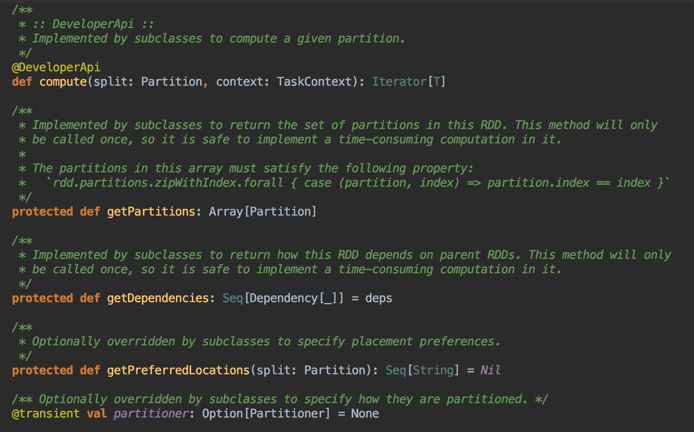
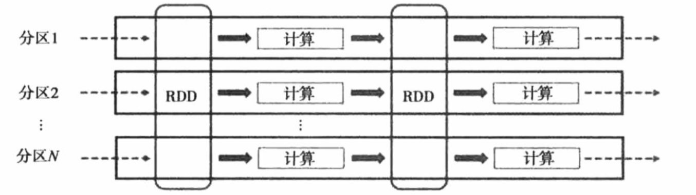

# spark RDD解释
##### 设计RDD抽象模型主要是为了解决三个问题:
1. Fast(速度):Spark之前的Hadoop用的是MapReduce的编程模型，没有很好的利用分布式内存系统，
   中间结果都需要保存到external disk，运行效率很低。RDD模型是in-memory
   computing的，中间结果不需要被物化（materialized），它的persistence机制，
   可以保存中间结果重复使用，对需要迭代运算的机器学习应用和交互式数据挖掘应用，
   加速显著。 Spark快还有一个原因就是Delay Scheduling机制，它得益于RDD的Dependency设计。
2. General(通用)：MapReduce编程模型只能提供有限的运算种类（Map和Reduce），RDD 
   希望支持更广泛更多样的operators（map，flatMap，filter等等），然后用户可以任意地组合他们。
3. Fault tolerance(容错):其他的in-memory storage on
   clusters，基本单元是可变的， 用细粒度更新（fine-grained
   updates）方式改变状态，如改变table/cell里面的值，这种模型的容错只能通过复制多个数据copy，
   需要传输大量的数据，容错效率低下。而RDD是不可变的（immutable），通过粗粒度变换（coarse-grained
   transformations），比如map，filter和join，可以把相同的运算同时作用在许多数据单元上，
   这样的变换只会产生新的RDD而不改变旧的RDD。这种模型可以让Spark用Lineage很高效地容错。

##### 定义及特性：
 RDD（Resilient Distributed Dataset）弹性分布式数据集：是Spark中的抽象数据结构类型，
任何数据在Spark中都被表示为RDD。可以简单的看成看成是一个数组，里面的数据是分区存储的。
不同分区的数据可以分布在不同的机器上，同时可以被并行处理。有如下几点概要：
- RDD是一个抽象类
- RDD带泛型，支持多种数据类型：String，Long，Object
- RDD是不可变的分区集合(只读)，支持并行计算

RDD有如下5个特性：
* A list of partitions

  由一系列的分区数据组成
* A function for computing each split

  每一个分片会计算函数
* A list of dependencies on other RDDs

  rdd之间存在一系列的关系
* Optionally, a Partitioner for key-value RDDs 
    (e.g. to say that the RDD is hash-partitioned)
    
    可选的，对于kv类型的rdd会作用一个Partitioner进行分区，类似MR里
* Optionally, a list of preferred locations to compute each split on 
   (e.g. block locations for an HDFS file）
   
   可选的，数据会就近进行计算（移动计算，数据本地化） 
   
**每个RDD子类都必须实现这些特性，在源码的体现：** 



RDD示例图： 



[RDD官方解释](http://spark.apache.org/docs/latest/rdd-programming-guide.html#resilient-distributed-datasets-rdds)

##### RDD创建:
1. 并行化驱动程序中的现有集合 
``` 
    val data = Array(1, 2, 3, 4, 5) 
    val distData = sc.parallelize(data)
```
2. 引用外部存储系统中的数据集，例如共享文件系统，HDFS，HBase或提供Hadoop
   InputFormat的任何数据源。通过文件的URI（本地路径file://，或hdfs://，或s3a://等URI）
   并将其作为行集合读取。
```
    scala> val distFile = sc.textFile("data.txt")
    distFile: org.apache.spark.rdd.RDD[String] = data.txt MapPartitionsRDD[10] at textFile at <console>:26
```
**Spark读取文件的一些注意事项**
1. 如果使用本地文件系统，则必须可以在工作节点上的相同路径上访问该文件。所以你需要 
   将文件复制到所有工作节点或使用网络安装的共享文件系统。
2. 文件读取支持文件、目录、正则写法如:textFile("/my/directory/file.txt"),
   textFile("/my/directory"),textFile("/my/directory/*.txt")
3. textFile方法还可以采用可选的第二个参数来控制文件的分区数。
   默认情况下，Spark为文件的每个块创建一个分区（HDFS中默认为128MB），
   但您也可以通过传递更大的值来请求更多的分区。 请注意，您不能拥有比块少的分区
   
并行度（Partitions）是一个很重要的参数，spark会为每个分区运行一个任务。通常，
希望群集中的每个CPU有2-4个分区。可以通过第二个参数传递给并行化来手动设置它

[sparkRDD创建示例代码: SparkRDDTest.scala](../src/main/scala/org/spark/notes/SparkRDDTest.scala)


 
